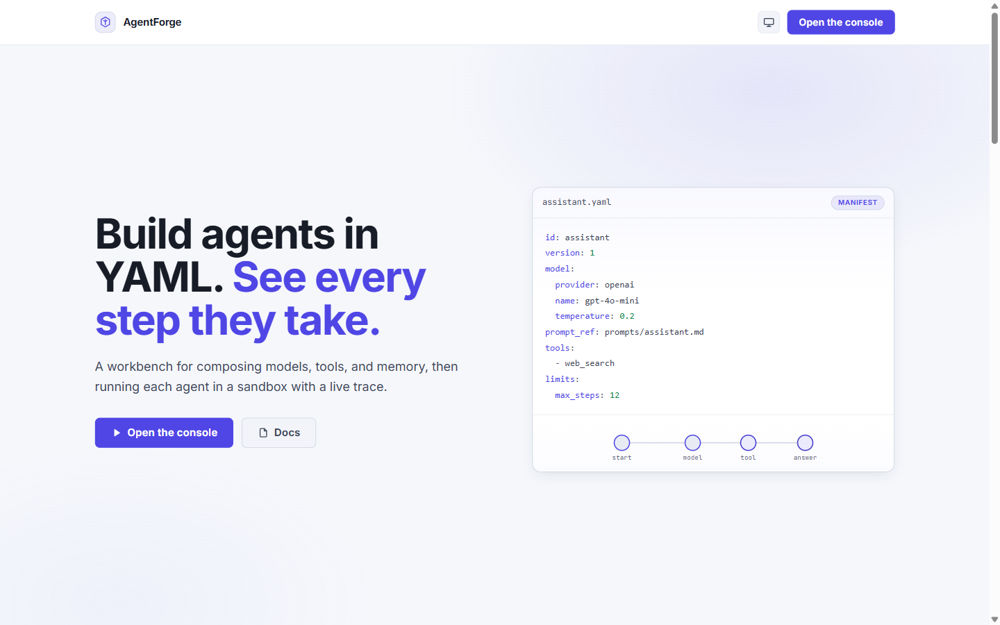
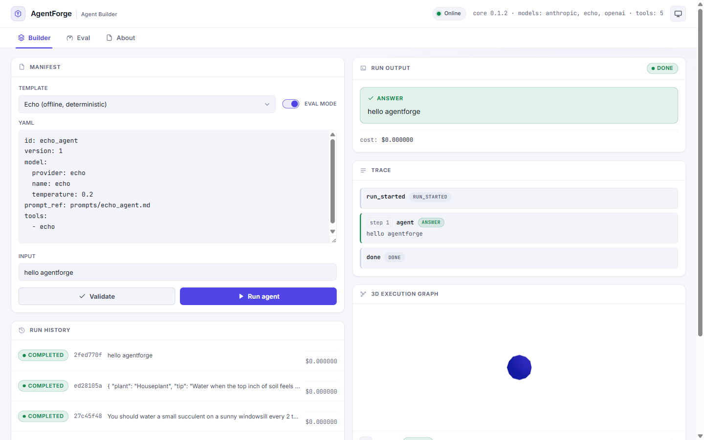
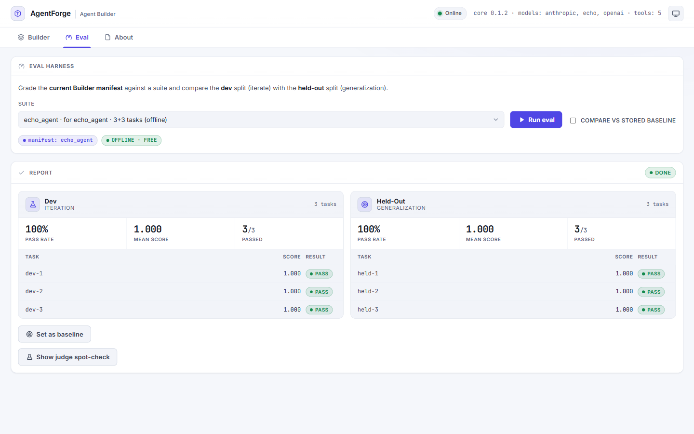

# AgentForge

[](https://pypi.org/project/pdz-agent-core/)

**Multi-agent workbench for building, running, observing, and extending AI systems — all controlled by a unified declarative manifest.**

Build agents in YAML. Run them safely in a sandbox. Watch execution in 3D. Evaluate rigorously. Extend without redesign.





---

## Capabilities

### Unified Agent Core
Declare everything in one manifest: agent ID, model config, prompts, tools, memory, MCP servers, limits, evaluation suite. Load at runtime. Extend with new tools, models, or memory backends without touching core code.

**What ships:**
- Manifest schema (Pydantic-validated YAML/JSON)
- Pluggable registries (tools, models, memory, MCP, prompts)
- LangGraph runtime with streaming traces
- Built-in tools: web search (Tavily), code execution (Docker sandbox), semantic search, HTTP fetch
- Multi-agent supervisor (agents as delegation tools)
- Long-term memory (mem0 + semantic storage)
- MCP auto-connector (discovery + tool adaptation)

### Live Agent Execution
Stream agent runs over Server-Sent Events (SSE). Watch tool calls, token counts, and errors flow in real-time from backend to browser.

### 3D Execution Graph
Visualize the agent graph and watch it execute: nodes pulse on activation, edges highlight on message/tool calls. Timeline scrubber replays the run from trace. Fallback 2D SVG for older browsers; reduced-motion support included.



### Agent Evaluation Harness
Implement the LLM analog of train/val/test:
- **Dev/held-out split** of tasks (iterate on dev, report on held-out) — prevents prompt overfitting
- **Scoring modes**: programmatic, rubric checks, LLM-as-judge (with mandatory human spot-checks)
- **Deterministic runs** (temperature 0, isolated memory) for stable pass/fail
- **Regression gate**: prompt/manifest edits re-run the suite; drops in held-out pass rate block promotion
- Full report with dev vs held-out side-by-side comparison

### Secure Sandbox
Execute agent-generated Python code in an isolated Docker container with deny-by-default isolation:
- No host filesystem or network access unless explicitly enabled
- CPU, memory, and wall-clock time limits
- Package allowlist for imports
- Secret redaction in logs and traces

Passed an 8-row security matrix (network blocking, FS denial, fork bombs, memory bombs, infinite loops, non-root enforcement, output capping, and import filtering).

### Manifest Versioning & Diff
Store and track manifest versions. View diffs between versions. Evaluate different versions against the same test suite.

### Observability & Cost Accounting
Every run produces a structured trace: steps, tool calls, model responses, latency, token usage. Export as JSON. View aggregated costs and token usage per agent and per run.

---

## Quickstart

### Prerequisites
- Python 3.10+
- Node.js 18+ (for the web UI)
- Docker (for the sandbox)

### Step 1: Backend (FastAPI on port 8077)

```bash
# Create a virtual environment
python -m venv .venv
# Windows:  .venv\Scripts\activate
# Unix:     source .venv/bin/activate

# Install agent-core (choose one):
# Option A: Local development (editable install)
pip install -e packages/agent-core

# Option B: From PyPI (with optional extras)
pip install pdz-agent-core  # or: pdz-agent-core[openai,anthropic,mcp]

# Install API dependencies
pip install -r apps/api/requirements.txt

# Run the API
python -m uvicorn app.main:app --port 8077 --app-dir apps/api
# -> http://localhost:8077/health
```

The API auto-loads `.env` from the repo root. Live runs require `OPENAI_API_KEY` or `ANTHROPIC_API_KEY`. The echo model works offline with no key.

### Step 2: Web UI (Next.js on port 3000)

In a new terminal:

```bash
cd apps/web
npm install
npm run dev
# -> http://localhost:3000/app (console)
```

The marketing landing page is served at `/` and the Agent Builder console at `/app`. The web app proxies `/api` to the backend — no CORS needed.

### Step 3 (Optional): Persistent Storage

AgentForge defaults to in-memory stores for quick demos. To persist runs, traces, and eval reports to PostgreSQL:

```bash
# Copy env template and fill in DATABASE_URL
cp .env.example .env
# Set: DATABASE_URL=postgresql://...

# Start Postgres via Docker Compose
docker compose -f infra/docker-compose.yml up -d
```

### First Run

1. Navigate to http://localhost:3000/app
2. Paste a manifest into the YAML editor (or use the template gallery)
3. Click Run to stream execution
4. Watch the 3D graph animate
5. Export the trace as JSON

---

## Architecture

AgentForge consists of **three core layers**:

1. **Unified Agent Core** (`packages/agent-core`): The harness — manifest schema, registries, LangGraph runtime, eval harness, tools, memory, sandbox interface.

2. **FastAPI Backend** (`apps/api`): REST + SSE endpoints for agents, runs, eval, sandbox, memory, and observability. Wraps the core.

3. **Next.js Frontend** (`apps/web`): Agent Builder UI — YAML editor, live run panel, 3D execution graph, run history, dark/light theme.

The frontend proxies `/api` to the backend (single origin, no CORS). The backend loads the core from the same Python package that FloraLens consumes — proving the core's reusability.

Read [`docs/architecture.md`](./docs/architecture.md) for a detailed breakdown with diagrams.

---

## Documentation

- **[Architecture](./docs/architecture.md)** — System design, module structure, runtime flow, data models
- **[API Reference](./docs/api.md)** — Every endpoint (agents, runs, eval, sandbox, memory, observability)
- **[Cross-Product Reuse](./docs/cross-product-reuse.md)** — How FloraLens consumes the unmodified core
- **[Product Requirements (PRD)](./PRD.md)** — Vision, goals, non-goals, detailed specs for all epics
- **[Implementation Plan](./IMPLEMENTATION-PLAN.md)** — Phased roadmap (Phases 0-12), what shipped and when

---

## Roadmap

See [docs/roadmap.md](./docs/roadmap.md) for the full vision organized as Now / Next / Later, including UI-testability wiring, doc reconciliation, integrations, and platform hardening. Current focus: finish what the docs promise and reconcile architecture claims with code.

---

## Status

**Phases 0–10 and 12 complete. Phase 11 (auth) partial.**

| Phase | Focus | Status |
|---|---|---|
| 0–1 | Foundation & unified core | ✓ |
| 2–3 | LangGraph runtime & tools | ✓ |
| 4 | Docker sandbox + security matrix | ✓ |
| 5 | Memory (mem0 + checkpointer) | ✓ |
| 6 | Multi-agent supervisor + UI | ✓ |
| 7 | 3D execution graph | ✓ |
| 8 | Traces & cost accounting | ✓ |
| 9 | Agent eval harness (dev/held-out) | ✓ |
| 10 | CI + test pyramid | ✓ |
| 11 | Auth & hardening | ◐ (opt-in key auth, no per-user isolation) |
| 12 | FloraLens integration proof | ✓ |

---

## Extending the Core (No Core Edits)

Add a custom tool in 15 minutes, no changes to `packages/agent-core`:

```python
from agent_core import BaseTool, ToolResult, build_default_registries

class WeatherTool(BaseTool):
    name = "weather"
    description = "Get the current temperature for a city."
    args_schema = WeatherArgs  # a Pydantic model

    async def run(self, city: str, **kwargs) -> ToolResult:
        # Your logic here
        return ToolResult(output=f"Temperature in {city}: 72°F")

# Register it
registries = build_default_registries()
registries.tools.register("weather", WeatherTool())

# Any manifest can now use it:
# tools: [weather, web_search]
```

The same pattern applies to model providers, memory backends, guardrails, and MCP connectors.

---

## Choose Your Model Provider

Set `model.provider` in your manifest to one of:

| Provider | Status | API Key |
|---|---|---|
| `anthropic` | ✓ Claude 3.x family | `ANTHROPIC_API_KEY` |
| `openai` | ✓ GPT-4, GPT-4o | `OPENAI_API_KEY` |
| `echo` | ✓ Offline (no key) | (none) |

Web search requires `TAVILY_API_KEY`. See `.env.example` for all options.

---

## Key Files

```
packages/agent-core/              # Shared core (also consumed by FloraLens)
├── src/agent_core/
│   ├── schema.py                 # Manifest + Agent definitions
│   ├── registry.py               # Pluggable registries
│   ├── runtime.py                # LangGraph compiler & executor
│   ├── eval.py                   # Dev/held-out harness
│   ├── tools/                    # Built-in tools
│   ├── models/                   # Model providers (Anthropic, OpenAI, Echo)
│   ├── memory/                   # Long-term & short-term memory
│   ├── sandbox/                  # Docker code executor
│   └── mcp/                      # MCP connector

apps/api/                         # FastAPI backend
├── app/main.py                   # All endpoints
├── app/auth.py                   # Optional API key auth
└── requirements.txt

apps/web/                         # Next.js Agent Builder
├── app/
│   ├── builder/                  # YAML editor + run panel
│   ├── components/TraceGraph3D   # 3D execution visualization
│   └── eval-panel.tsx            # Dev/held-out report view

docs/                             # This documentation
infra/docker-compose.yml          # Postgres + full stack
suites/                           # Eval task suites
```

---

## Learning Resources

- **Built a tool in an afternoon:** Try adding `WeatherTool` as shown above.
- **Ran an eval suite:** Start with the examples in `suites/`.
- **Explored the sandbox:** See `POST /api/sandbox/exec` in the API docs.
- **Integrated MCP:** Follow the MCP connector guide in the architecture docs.

---

## License

See LICENSE in the repo root.
